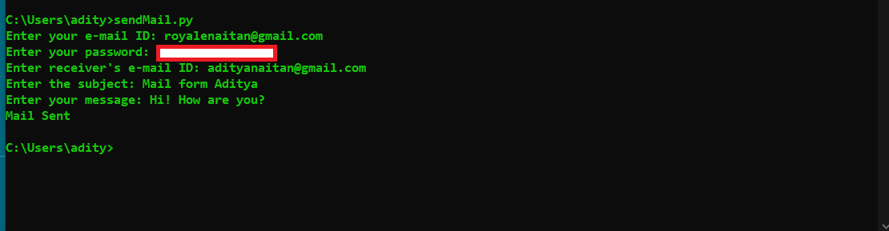
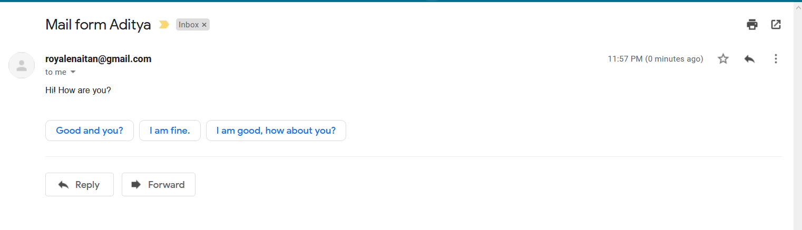

# sendmail

I have used "smtplib" module of python to send mail, in order to send mail using 3rd party app you have to change the settings of your gmail account to allow other apps for sending mails.

